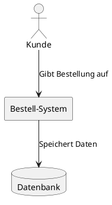
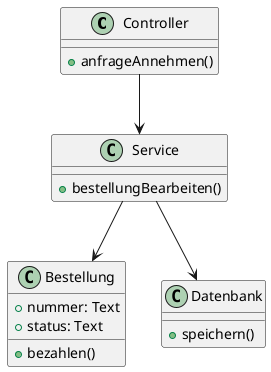
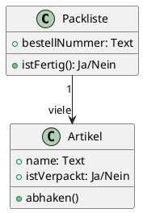

### A) Theorie: Grundlagen der Softwarearchitektur

- **Softwarearchitektur:** Der Bauplan eines Programms. Er zeigt, wie das Programm aufgebaut ist.
- **Dokumentation:** Man schreibt Text auf (z.B. mit dem arc42-Muster) und zeichnet Bilder (z.B. C4-Diagramme).
- **Langlebige Software (nach Lilienthal):**
  - **Modular:** Das Programm ist in kleine Teile (Module) aufgeteilt.
  - **Unabhängig:** Die Teile brauchen sich gegenseitig so wenig wie möglich.
- **Modulith:** Ein einziges großes Programm, das innen sehr streng aufgeräumt und in Einzelteile (Module) getrennt ist.
- **Ports and Adapters Architektur:**
  - Die wichtige Programm-Logik ist in der Mitte versteckt.
  - **Ports (Anschlüsse):** Die Mitte hat "Steckdosen" für die Außenwelt.
  - **Adapter (Stecker):** Externe Dinge wie Datenbanken oder Internetseiten werden über "Stecker" mit der Mitte verbunden.
- **DDD (Domain-Driven Design) Bausteine:**
  - **Entity:** Ein Ding, das sich verändert, aber immer dieselbe Nummer (ID) behält (z.B. ein Kunde).
  - **Value Object:** Ein Ding, das nur aus Werten besteht und keine ID hat (z.B. eine Adresse).
  - **Aggregate:** Eine Gruppe aus Entities, die zusammengehören (z.B. eine Bestellung mit all ihren Artikeln).

---

### A1) Bestellungen (Ordermanagement)

- **Hauptaufgabe:** Bestellungen von Kunden annehmen und speichern.
- **Ablauf:**
  1. Kunde gibt eine Bestellung auf (über eine Internet-Schnittstelle).
  2. Das System verarbeitet die Daten (z.B. Status auf "bezahlt" ändern).
  3. Die Datenbank speichert alles dauerhaft ab.
- **Wichtige Programmteile:**
  - Controller: Nimmt die Anfragen vom Kunden an.
  - Service: Erledigt die eigentliche Arbeit im Hintergrund.
  - Repository: Ist nur dafür da, die Daten in die Datenbank zu schreiben.

---

### A2) Lager (Stockmanagement)

- **Hauptaufgabe:** Packlisten für die Bestellungen verwalten.
- **Ablauf:**
  1. Für jede Bestellung wird eine neue Packliste (`PackingList`) erstellt.
  2. Auf der Liste stehen einzelne Artikel (`PackingItem`).
  3. Ein Mitarbeiter hakt die Artikel ab, sobald sie im Paket sind.
  4. Wenn alle Artikel abgehakt sind, ist die ganze Bestellung fertig verpackt.

---

### C) Zusatz: Spring Modulith

- **Was ist das?** Ein Hilfsprogramm, das uns beim Programmieren unterstützt.
- **Was es macht:**
  - **Ordnung im Code:** Bisher mussten wir selbst aufpassen, dass alles getrennt bleibt – Spring Modulith schlägt bei Fehlern sofort Alarm.
  - **Diagramme zeichnen:** Früher haben wir sie mühsam selbst geschrieben (z.B. mit PlantUML) – jetzt erstellt das Programm die Bilder automatisch aus dem Code.
